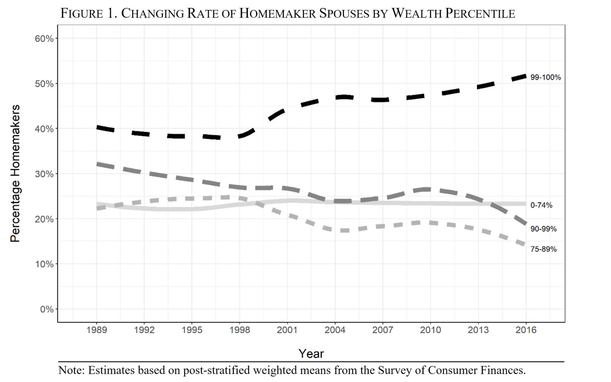

Overwork, Specialization, and Wealth
=====

  

About
-----
This repository was written in 2017-2018 and was used to publish [this paper](https://onlinelibrary.wiley.com/doi/abs/10.1111/jomf.12596). With data from the Survey of Consumer Finances (SCF), this repository estimates unconditional quantile regression models to investigate how overwork and household specialization are associated with household wealth across socioeconomic strata and over time. Results indicate that overwork has the greatest absolute benefits at the top of the wealth distribution but the greatest relative benefits in lower portions of the wealth distribution. Specialization yields distinct advantages for high-wealth households that have grown over time, whereas specialization comes with tradeoffs for low-wealth households that outweigh its benefits. The scripts were initially written with SAS, but R is used in later steps for estimating unconditional quantile regression models and visualizing the results.
